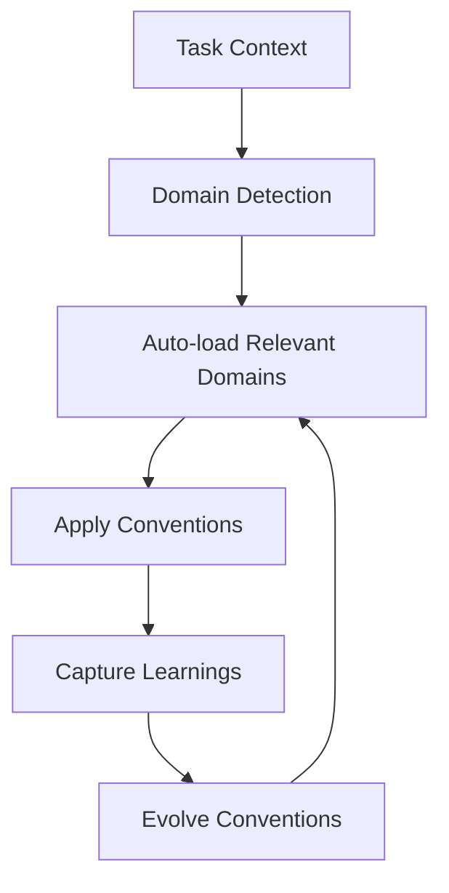

# AI Conventions

Cookiecutter template for creating AI development convention projects. This template helps teams establish and maintain consistent coding standards when working with AI assistants like Claude, Cursor, Windsurf, and Aider.

## 🚀 Key Features

- **Interactive Domain Selection**: Choose from curated convention domains
- **Multi-Provider Support**: Works with Claude, Cursor, Windsurf, Aider, and more
- **Learning Capture**: Automatically capture and evolve conventions from development patterns
- **Domain Composition**: Build complex conventions by extending base domains
- **Progressive Context Loading**: Automatic convention loading based on task context

## 🎯 Quick Start

1. **Generate a new project:**
   ```bash
   cookiecutter gh:safurrier/cookiecutter-ai-conventions
   ```

2. **Install the CLI:**
   ```bash
   cd your-project
   uv tool install .
   ```

3. **Check status:**
   ```bash
   ai-conventions status
   ```

4. **Start coding** with your AI assistant!

## 🏗️ Architecture

The AI conventions system uses a progressive context loading approach:



## 📚 Core Concepts

- **Domains**: Specialized convention sets (git, testing, writing, etc.)
- **Providers**: AI tool integrations (Claude, Cursor, etc.)
- **Learning Capture**: Automatic pattern detection and convention evolution
- **Context Loading**: Smart convention loading based on task detection

## 🌟 Why AI Conventions?

Traditional development standards become even more critical when working with AI assistants. This system ensures:

- **Consistency** across AI-generated code
- **Quality** through automated convention enforcement
- **Evolution** of standards based on real usage patterns
- **Team Alignment** on coding practices

## 🔧 Supported AI Tools

| Provider | Status | Features |
|----------|--------|----------|
| **Claude** | ✅ Full Support | Context loading, learning capture |
| **Cursor** | ✅ Full Support | Rules integration, context awareness |
| **Windsurf** | ✅ Full Support | Native rule support |
| **Aider** | ✅ Full Support | Convention integration |
| **GitHub Copilot** | ✅ Full Support | Instructions and prompts |

## 📖 Documentation

- [**Getting Started**](getting-started.md) - Installation and setup
- [**User Guide**](providers.md) - Provider configuration
- [**Examples**](examples/migration-from-cursorrules.md) - Migration scenarios
- [**API Reference**](reference/api.md) - Technical documentation

## 🤝 Contributing

We welcome contributions! See our [Contributing Guide](https://github.com/safurrier/cookiecutter-ai-conventions/blob/main/CONTRIBUTING.md) for details.

## 📄 License

MIT License - see [LICENSE](https://github.com/safurrier/cookiecutter-ai-conventions/blob/main/LICENSE) for details.